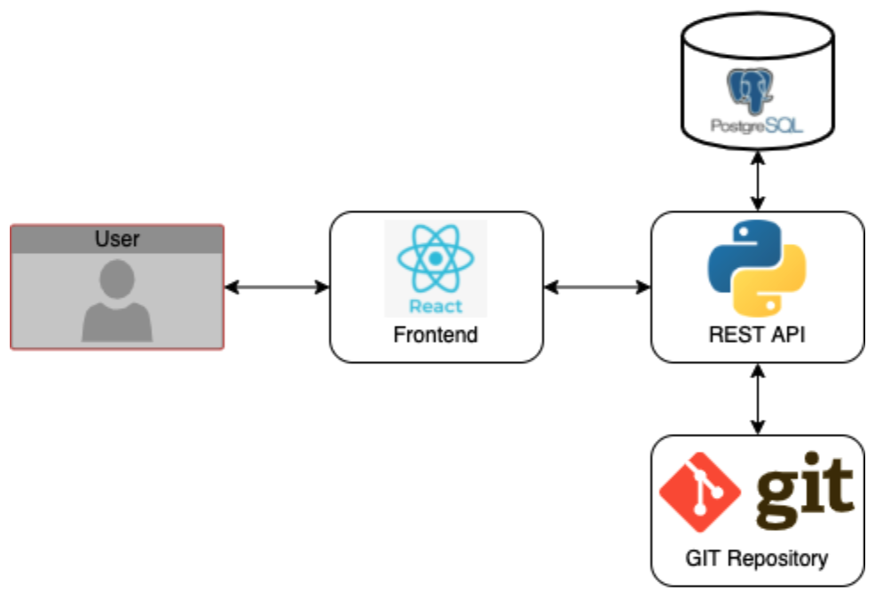
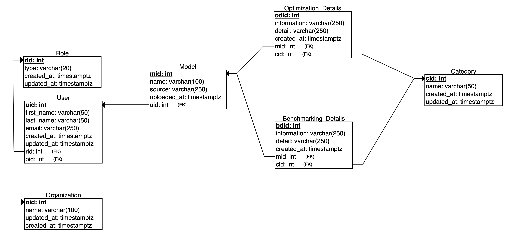

# BenchML

## Team Members

* Fernando Davis - fernando.davis@upr.edu
* Gabriel Rosa - gabriel.rosa4@upr.edu
* Carolina Santiago - carolina.santiago5@upr.edu
* Enrique Viera - enrique.viera@upr.edu

### Professor: Dr. Wilson Rivera

## System Architecture

## Database

## Team Roles
### Gabriel Rosa - Backend Developer
- In charge of the database and back-end development. Will develop the database in PostgreSQL and the backend in Python.

### Enrique Viera - Middleware Developer
- In charge of routing between front and back end. Will help with development of some front-end features and back-end changes.

### Fernando Davis - Machine Learning Scientist
- In charge of optimizing and benchmarking code the machine learning models in Python using various libraries.
- The development of the code for Machine Learning will be done in Python.

### Carolina Santiago Pérez - Frontend Developer
- Will lead the front-end features. Develops the different pages of the application using Node.

---

#### About the project
This project is part of the course CIIC4151 of the Department of Computer Science and Engineering. University of Puerto Rico, Mayaguez Campus.
