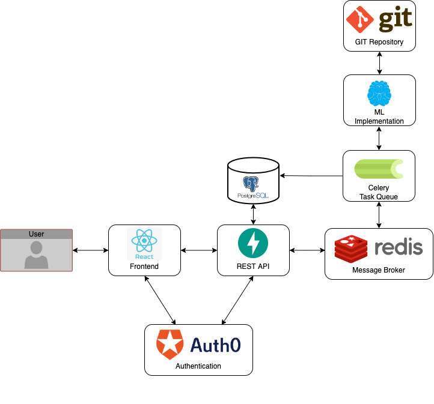

# BenchML

## Team Members

* Fernando Davis - fernando.davis@upr.edu
* Gabriel Rosa - gabriel.rosa4@upr.edu
* Carolina Santiago - carolina.santiago5@upr.edu
* Enrique Viera - enrique.viera@upr.edu

### Professor: Dr. Wilson Rivera

## Final Presentation
 [Download the final presentation](documentation/page/media/Capstone_Final_Presentation.pdf)

## System Architecture


## Database


## Hyperparameter Optimization

The hyperparameter optimization module takes in a user input url that contains a json config file describing the model. 

We recommend using gist.github.com to create a public file containing the json and using the raw version of that file as the provided url. An example can be found here: [Gist link for below example](https://gist.github.com/FernandoDavis/dd921303e9cb6faac80bca553ca12008)

Example of model.json file:

{  
"model_type": "pytorch",  
"layers" : [  
["Conv2d", "3", "6", "5"],  
["ReLU"],  
["MaxPool2d", "2", "2"],  
["Conv2d", "6", "16", "5"],  
["ReLU"],  
["MaxPool2d", "2", "2"],  
["Reshape", "-1", "400"],  
["Linear", "400", "nodes1"],  
["ReLU"],  
["Linear", "nodes1", "84"],  
["ReLU"],  
["Linear", "84", "10"]  
],  
"nodes1" : "",  
"lr": "",  
"batch_size" : ""   
}  

The variables and choices are described below:
- model_type: ["pytorch", "keras"]
    - Keras is TODO!
- layers: [Conv2d, ReLU, MaxPool2d, Linear]
    - Each layer is a separate list with or without attributes and must be a valid layer depending on the model chosen.
    - The parameters for the layers are included in each line: ```["Linear", "84", "10"]```  
    - Number of nodes in layers can point to a "l#" where # is the amount ```["Linear", "nodes1", "10"]```  so that ray can apply hyperparameter optimization to it.
    - Compound layers are not supported, each layer will be applied one at a time.
- lr: learning rate value. If you want it to be optimized, leave blank.
- batch_size: batch_size for the model. It you want it to be optimized, leave blank.
- nodes#: for each nodes key in the config file, it will be optimized for values between 2^2 - 2^9.

Currently, optimization can only be done for pytorch models and the hyperparameters that can be optimized are:
- numbers of nodes in a layer
- learning rate
- batch size

An example standalone notebook that uses the built in hyperparameter optimization built into our benchmarking application and for the above example config can be found here: [Google Colab Notebook](https://colab.research.google.com/drive/1NSskJoz91NIl8HfTfm9ghfIw0HsfPpXA?usp=sharing)


## Team Roles
### Gabriel Rosa - Backend Developer
- In charge of the database and back-end development. Will develop the database in PostgreSQL and the backend in Python.

### Enrique Viera - Middleware Developer
- In charge of routing between front and back end. Will help with development of some front-end features and back-end changes.

### Fernando Davis - Machine Learning Scientist
- In charge of optimizing and benchmarking code the machine learning models in Python using various libraries.
- The development of the code for Machine Learning will be done in Python.

### Carolina Santiago Pérez - Frontend Developer
- Will lead the front-end features. Develops the different pages of the application using Node.

---

#### About the project
This project is part of the course CIIC4151 of the Department of Computer Science and Engineering. University of Puerto Rico, Mayaguez Campus.
